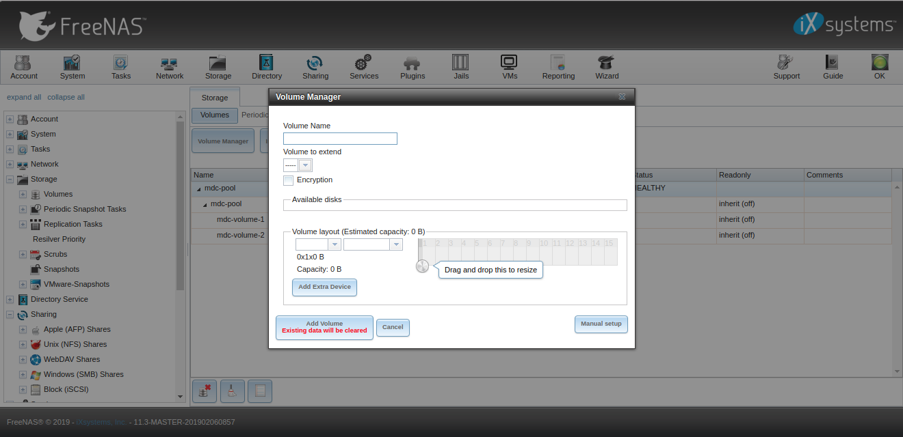
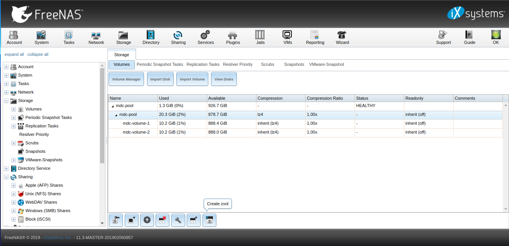
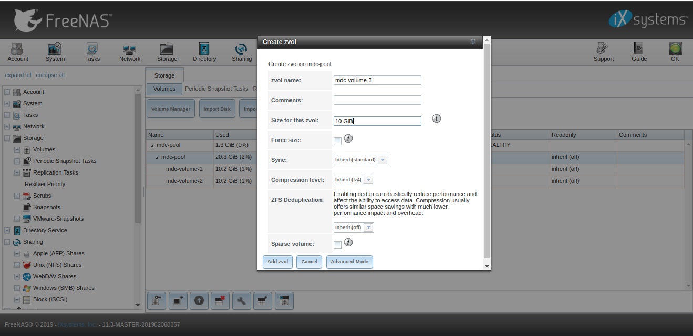
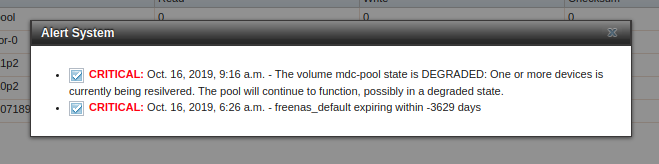
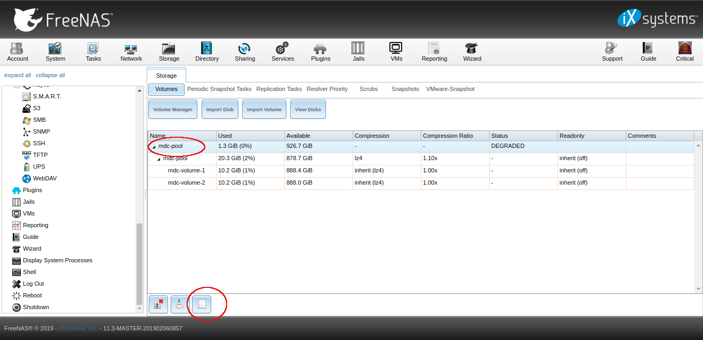
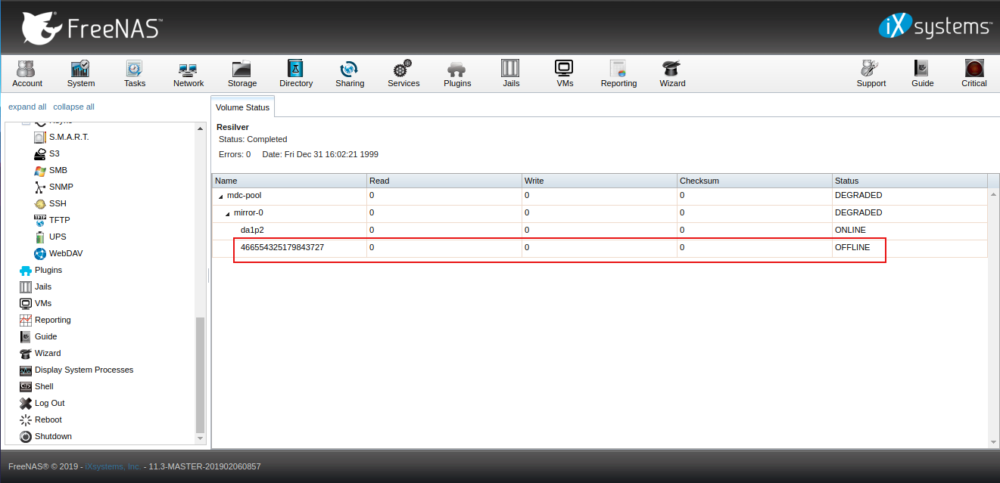
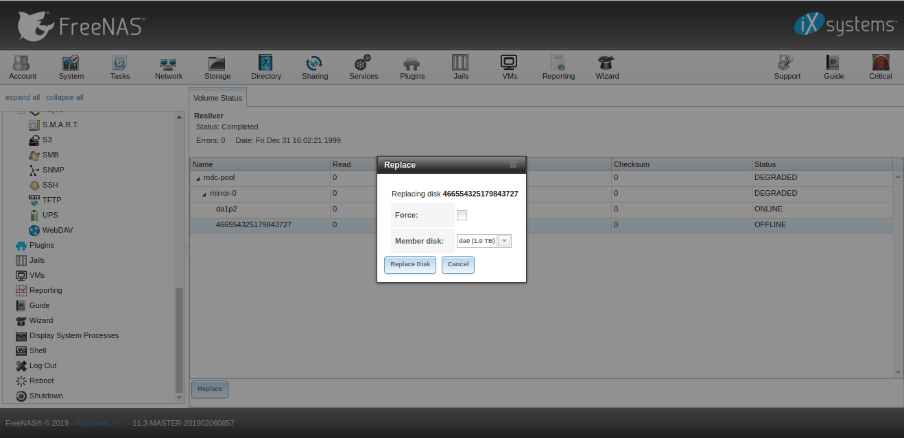
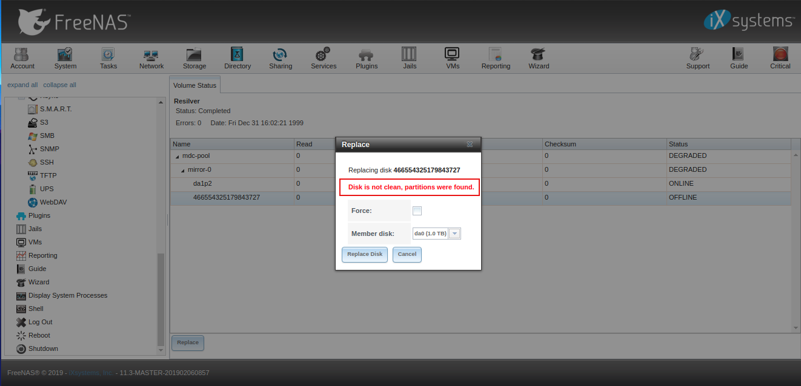
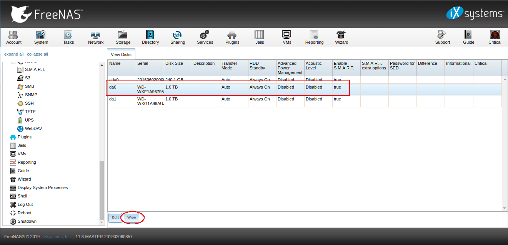
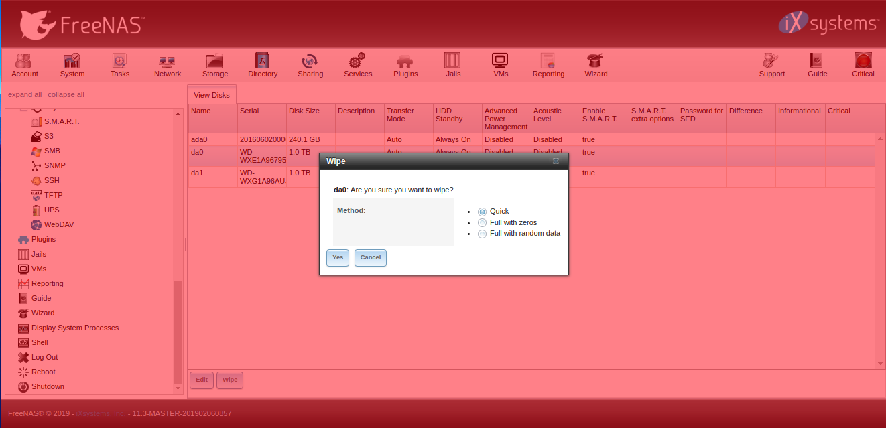

## Freenas


### Content
[1. Connect FreeNAS ISCSI to Ubuntu M/C](#1-connect-freenas-iscsi-to-ubuntu-mc)\
[2. Storage](#2-storage)\
&nbsp;&nbsp;&nbsp;[2.1 Volume Manager (Creating a pool)](#21-volume-manager-creating-a-pool)\
&nbsp;&nbsp;&nbsp;[2.1 Create Zvolume](#22-create-zvolume)\
[3. Replacing Fault disk from freeNAS zpool](#3-replacing-fault-disk-from-freenas-zpool)

----

<br><br><br><br><br><br>

#### 1. Connect FreeNAS ISCSI to Ubuntu M/C
To connect FreeNAS ISCSI to and ubuntu m/c you need to install a ISCSI client and do some configurations. 
First you need to install open-iscsi

```bash
sudo apt-get install open-iscsi
```
Default configuration file could be located at /etc/iscsi/iscsid.conf you need to edit the configuration files.

```bash
sudo vim /etc/iscsi/iscsid.conf
```
Set node.session.auth.username, node.session.auth.password and other parameter as follows
```bash
node.startup = automatic
node.session.auth.username = MY-ISCSI-USER
node.session.auth.password = MY-ISCSI-PASSWORD
discovery.sendtargets.auth.username = MY-ISCSI-USER
discovery.sendtargets.auth.password = MY-ISCSI-PASSWORD
node.session.timeo.replacement_timeout = 120
node.conn[0].timeo.login_timeout = 15
node.conn[0].timeo.logout_timeout = 15
node.conn[0].timeo.noop_out_interval = 10
node.conn[0].timeo.noop_out_timeout = 15
node.session.iscsi.InitialR2T = No
node.session.iscsi.ImmediateData = Yes
node.session.iscsi.FirstBurstLength = 262144
node.session.iscsi.MaxBurstLength = 16776192
node.conn[0].iscsi.MaxRecvDataSegmentLength = 65536
```
Save and close the file. Restart open-iscsi service
```bash
sudo /etc/init.d/open-iscsi restart
```
Now you need to run a discovery against the iscsi target host
```bash
iscsiadm --mode discovery --type sendtargets --portal ISCSI-SERVER-IP-ADDRESS
```
Note down the record id found by the discovery. You need the same for login. Login, must use a node record id found by the discovery
```bash
sudo iscsiadm --mode node --targetname RECORD-ID --portal ISCSI-SERVER-IP-ADDRESS:PORT --login
```
Finally restart the service again
```bash
sudo /etc/init.d/open-iscsi restart
```

#### 2. Storage
##### 2.1 Volume Manager (Creating a pool)
To create a pool use Volume Manager button in Storage section
```
Storage -> Volume Manager
```
Step 1:


Step 2:


##### 2.2 Create Zvolume
For creating zvol click in the pool name in that table.
```
Storage -> (click on the pool name in table) -> (at bottom click on Create zvol)
```
Step 1:


Step 2:


#### 3. Replacing Fault disk from freeNAS zpool
If the zpool disk goes unavilable or offline it means something happens to the disk its a serious issue to take care. Normaly we find this issue in alert .


To replace a disk in a zpool do the following steps
```
Storage -> (click in volume pool name) -> (in bottom Volume status)
```
There you can see disk partation attached to the pool and see that which disk goes offline or unavailable click on that disk and replace it.\
Step 1:

Step 2:

Step 3:


While replacing the disk if get some error like disk is not clean , you just need to wipe the disk \
Step 1:

Step 2:

Step 3:


If the about step won't work you have to try using shell. you will see a shell option on the web.
Execute the following commands.
```bash
zpool status -v POOL-NAME
```
You can see the pool status and locate which disk goes down.
```bash
pool: POOL-NAME
 state: DEGRADED
status: One or more devices could not be opened.  Sufficient replicas exist for
        the pool to continue functioning in a degraded state.
action: Attach the missing device and online it using 'POOL-NAME online'.
   see: http://illumos.org/msg/ZFS-8000-2Q

config:

        NAME                                            STATE     READ WRITE CKSUM
        POOL-NAME                                       DEGRADED     0     0     0
          raidz2-0                                      DEGRADED     0     0     0
            gptid/11111111-2222-3333-4444-555555555555  ONLINE       0     0     0
            gptid/22222222-2222-3333-4444-555555555555  ONLINE       0     0     0
            99999999999999999999                        UNAVAIL      0     0     0  was /dev/da0
            gptid/33333333-2222-3333-4444-555555555555  ONLINE       0     0     0
            gptid/44444444-2222-3333-4444-555555555555  ONLINE       0     0     0
            gptid/55555555-2222-3333-4444-555555555555  ONLINE       0     0     0

errors: No known data errors
```
Solution via shell.
1. Replace the physical hard drive. For this, shutdown the machine if necessary. 
2. Partition the hard drive. Following is an example where we assume the disk is /dev/da0
```bash
# create gpt called da0
gpart create -s gpt da0
# create a 2G swap partition (it will be da0p1)
gpart add -i 1 -b 128 -t freebsd-swap -s 2G da0
# create a second partition using the rest of the space (it will be da0p2)
gpart add -i 2 -t freebsd-zfs da0
# replace disk labeled "99999999999999999999" by da0p2. See the error message example above. 
zpool replace MyZpool 99999999999999999999 da0p2
```
