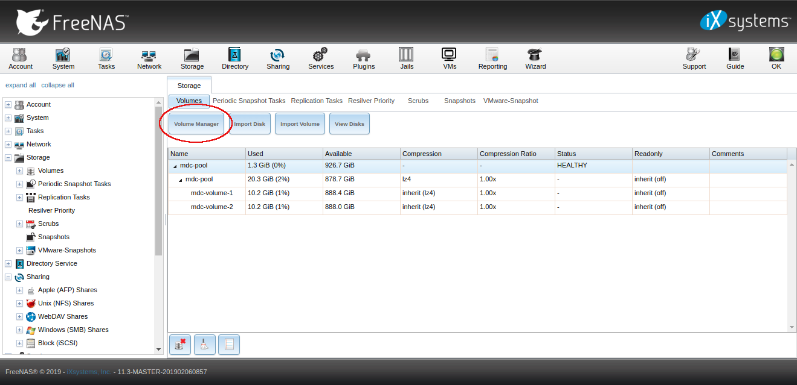

## Freenas


### Content
1. Connect FreeNAS ISCSI to Ubuntu M/C
1. Storage
   1. Volume Manager (Creating a pool)
   1. Create Zvolume


#### 1. Connect FreeNAS ISCSI to Ubuntu M/C
To connect FreeNAS ISCSI to and ubuntu m/c you need to install a ISCSI client and do some configurations. 
First you need to install open-iscsi

```bash
sudo apt-get install open-iscsi
```
Default configuration file could be located at /etc/iscsi/iscsid.conf you need to edit the configuration files.

```bash
sudo vim /etc/iscsi/iscsid.conf
```
Set node.session.auth.username, node.session.auth.password and other parameter as follows
```bash
node.startup = automatic
node.session.auth.username = MY-ISCSI-USER
node.session.auth.password = MY-ISCSI-PASSWORD
discovery.sendtargets.auth.username = MY-ISCSI-USER
discovery.sendtargets.auth.password = MY-ISCSI-PASSWORD
node.session.timeo.replacement_timeout = 120
node.conn[0].timeo.login_timeout = 15
node.conn[0].timeo.logout_timeout = 15
node.conn[0].timeo.noop_out_interval = 10
node.conn[0].timeo.noop_out_timeout = 15
node.session.iscsi.InitialR2T = No
node.session.iscsi.ImmediateData = Yes
node.session.iscsi.FirstBurstLength = 262144
node.session.iscsi.MaxBurstLength = 16776192
node.conn[0].iscsi.MaxRecvDataSegmentLength = 65536
```
Save and close the file. Restart open-iscsi service
```bash
sudo /etc/init.d/open-iscsi restart
```
Now you need to run a discovery against the iscsi target host
```bash
iscsiadm --mode discovery --type sendtargets --portal ISCSI-SERVER-IP-ADDRESS
```
Note down the record id found by the discovery. You need the same for login. Login, must use a node record id found by the discovery
```bash
sudo iscsiadm --mode node --targetname RECORD-ID --portal ISCSI-SERVER-IP-ADDRESS:PORT --login
```
Finally restart the service again
```bash
sudo /etc/init.d/open-iscsi restart
```

#### 2. Storage
##### 2.1 Volume Manager (Creating a pool)
To create a pool use Volume Manager button in Storage section
```
Storage -> Volume Manager
```
Step 1:


Step 2:


